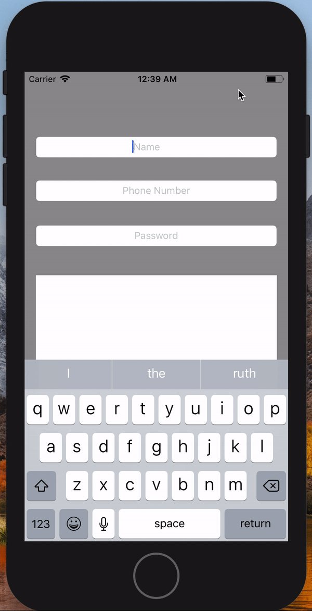

# UITextFieldBascisFunctionality

This is a simple app which consists of 3 text fields and one button and one textview .
Idea of an app is to display those filed which is given my the user entry data and display the data after clicking the button.
those fields are UserName which is normal Keyborad has the functionality clear the text using the attributes and normal keyborad
second field is that Phone number which has only phone no keyboard where the keyboard disappears clicking the outside of the keyboard 
third text field is password which security enable ,later on i'll add show and hide password to the field.

button is rounded using cornor radius 
just passing the all the data to the text veiw to display

 
**Show case:**
 

  

